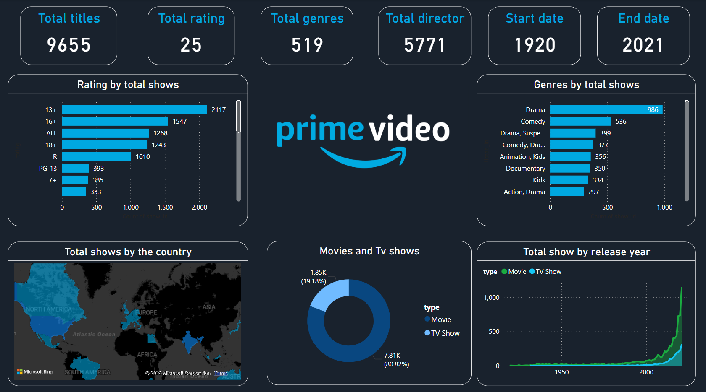
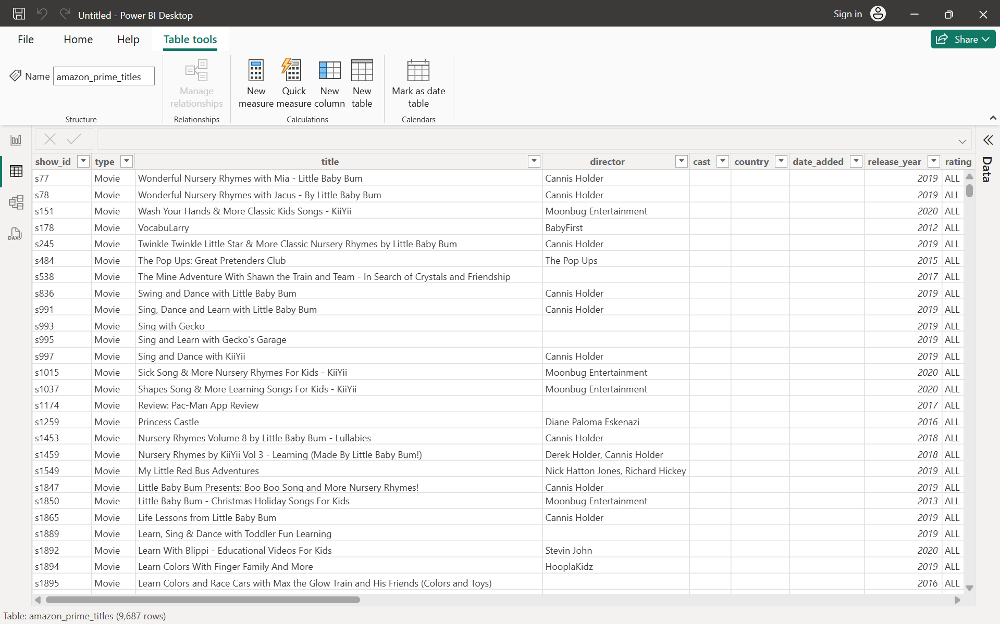

# Amazon Prime Titles Dashboard - Power BI Project

## Overview

This project is a **Data Analysis Dashboard of Amazon Prime Titles** built in **Power BI**. It provides insights into thousands of titles available on Amazon Prime, including their genres, ratings, release years, country distribution, and more. The goal is to understand the content library through data-driven visuals.

---

## Objectives

- Analyze the number of titles by **type**, **genre**, **rating**, and **release year**
- Visualize **geographical distribution** of shows
- Identify trends over time and content categories
- Improve decision-making using interactive visuals and slicers

---

## Dataset

- **Source**: Public dataset of Amazon Prime shows and movies
- **Total Records**: 9,687 rows
- **Key Columns**: show_id, title, director, country, release_year, rating, type, genre

---

## Key Features

- **KPIs**: Total titles, ratings, genres, directors, start & end date
- **Visuals Included**:
  - Bar chart of ratings by total shows
  - Bar chart of genres by number of shows
  - World map showing show distribution by country
  - Donut chart for Movies vs TV Shows
  - Line chart for shows released per year

---

## Screenshots

*Data model preview showing raw dataset*

*Interactive dashboard with visuals, filters, and KPIs*

---

## Tools Used

- **Power BI Desktop**
- **Microsoft Excel** (initial cleanup)
- **DAX** for calculated measures
- **Map Visual**, **Bar Charts**, **Donut Charts**, and **KPIs**

---
